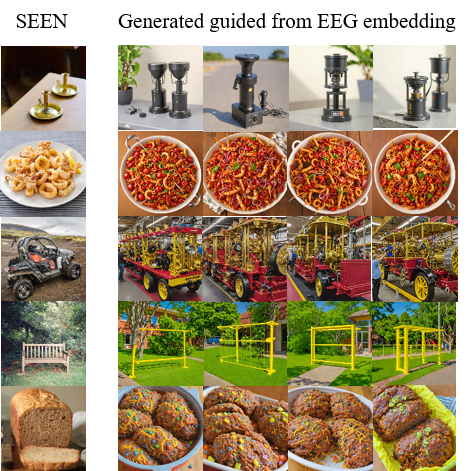

# LaBraM for Diffusion

[](https://opensource.org/licenses/MIT)
[](https://www.python.org/downloads/release/python-380/)

This project utilizes EEG features extracted by the LaBraM model to guide a two-stage diffusion model for image generation, based on the eeg-things dataset.

---

## 🎨 Results

Here are some examples of images generated by our model, conditioned on EEG signals recorded while a subject viewed corresponding images.




## 📖 Introduction

This repository explores the intersection of Brain-Computer Interfaces (BCI) and advanced generative models. We employ the [LaBraM](https://github.com/braindecode/braindecode) model to extract rich, high-level representations from the [eeg-things dataset](https://osf.io/59caq/). These neural features are then used as a conditional input to guide [Diffusion](https://github.com/ncclab-sustech/EEG_Image_decode), enabling the synthesis of images directly from brain activity.

## ✨ Key Features

*   **EEG Feature Extraction**: Leverages a pre-trained LaBraM model for efficient and powerful EEG feature extraction.
*   **Conditional Image Generation**: Guides a two stage diffusion model using neural signals to generate semantically relevant images.
*   **Modular Pipeline**: Provides a clear and complete pipeline for data preprocessing, model training, and inference.
*   **Reproducibility**: Includes all necessary code and instructions to replicate our findings.

## 🚀 Getting Started

Follow these instructions to set up the project environment and run the code.

### Prerequisites

*   Python 3.8 or later
*   Git and [Git LFS](https://git-lfs.github.com/)

### Installation

1.  **Clone the repository:**
    ```bash
    git clone https://github.com/chigaogao/labram-for-diffusion.git
    cd labram-for-diffusion
    ```

2.  **Set up a virtual environment** (recommended):
    ```bash
    # For Linux/macOS
    python3 -m venv venv
    source venv/bin/activate

    # For Windows
    python -m venv venv
    .\venv\Scripts\activate
    ```

3.  **Install the required packages:**
    ```bash
    pip install -r requirements.txt
    ```

4.  **Download model weights and datasets:**
    This project uses Git LFS to handle large files. After cloning, pull the LFS files:
    ```bash
    # This will download all large files tracked by LFS (e.g., .pth, .pt)
    git lfs pull
    ```
    <!-- If users need to download other datasets manually, provide instructions here. -->
    Please download the required dataset from [this link](https://things-initiative.org/).

## 💻 Usage

### 1. Data Preprocessing

To process the raw EEG data into a usable format, run the preprocessing script(sample rate must be 200Hz to fit the labram):
```bash
python EEG-preprocessing/preprocessing.py --data_path path/to/raw_data --output_path path/to/processed_data
```
### 2. Model Training
To finetune the labram and train the prior diffusion model from scratch, use the following command:
```bash
python main.py 
```
```bash
python train_diffuse.py 
```
### 3. Inference (Image Generation)

To generate an image using a trained checkpoint and an EEG data sample:
```bash
python adpatersdxl.py 
```
## 📂 Project Structure

```
.
├── EEG-preprocessing/      # Scripts for EEG data preprocessing
├── LaBraM for eegthings/   # Code for the LaBraM model and associated pipeline
├── checkpoints/            # Stores trained model weights
├── data/                   # Placeholder for datasets (to be created/downloaded by user)
├── results/                # Default directory for saving generated images
├── .gitattributes          # Configuration for Git LFS
├── .gitignore              # Specifies intentionally untracked files to ignore
├── LICENSE                 # Project license file
├── README.md               # This file
└── requirements.txt        # A list of Python packages required for the project
```

## 🙏 Acknowledgements

This work would not have been possible without the following incredible projects and datasets:
*   The **LaBraM** model and its original [implementation](<!-- link to LaBraM's GitHub or paper -->).
*   The **eeg-things** [dataset](https://osf.io/59caq/).
*   The foundational work on **preprocess and two-stage Stable Diffusion** by [CompVis](https://github.com/ncclab-sustech/EEG_Image_decode).

## 📜 License

This project is licensed under the MIT License. See the [LICENSE](LICENSE) file for more details.